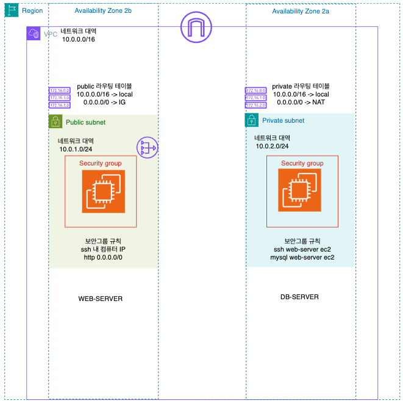
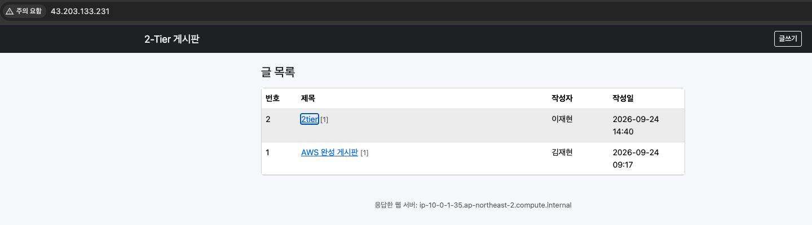
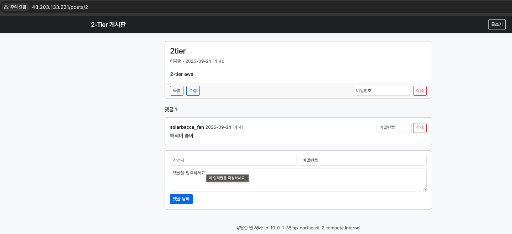
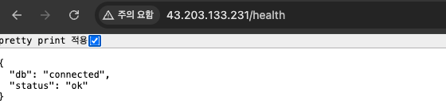
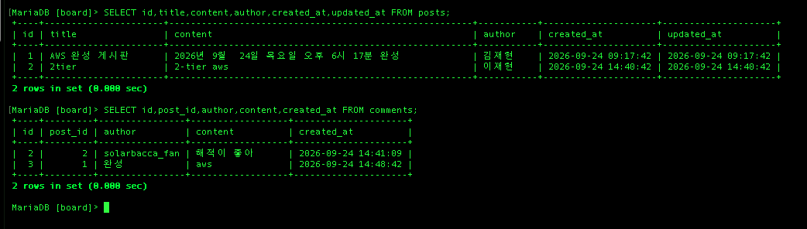

# AWS 2-Tier 실습용 게시판

AWS에서 **웹 티어(EC2) + DB 티어(EC2)** 로 나뉜 2-Tier 구조를 직접 구축해 보기 위한 Flask 게시판입니다.

## 아키텍처



## 동작 확인

인터넷에서 웹 EC2(Public Subnet)로 접속하고, 작성한 글이 DB EC2(Private Subnet)의 MariaDB에 저장되는 것을 확인했습니다.

### 글 목록



페이지 하단의 "응답한 웹 서버"가 웹 EC2(`ip-10-0-1-35`)의 호스트명입니다.

### 글 상세 · 댓글



### 헬스 체크: 웹 EC2 → DB EC2 연결



### DB EC2에 저장된 데이터



DB EC2에서 조회한 결과로, 브라우저에서 쓴 글·댓글이 그대로 저장되어 있습니다.

## 폴더 구조

```
.
├── infra/          # 인프라: 무엇을 어떻게 구축하는지
│   ├── aws/        #   AWS 콘솔에서 만드는 리소스와 설정값
│   └── server/     #   EC2 안에서 하는 설정 (MariaDB · Gunicorn · Nginx)
├── app/            # 앱: 인프라 위에서 동작하는 Flask 게시판
└── images/         # 아키텍처 다이어그램
```

## Infra

### AWS 리소스

구축해야 하는 AWS 서비스와 이 실습의 설정값입니다.

| 문서 | 서비스 |
| --- | --- |
| [네트워크](infra/aws/network.md) | VPC · 서브넷 · 인터넷 게이트웨이 · NAT 게이트웨이 · 라우팅 테이블 |
| [보안](infra/aws/security.md) | 보안 그룹 · 키 페어 |
| [컴퓨팅](infra/aws/compute.md) | EC2 (웹 / DB) |

### 서버 설정

| 문서 | 내용 |
| --- | --- |
| [서버 설정](infra/server/server-setup.md) | EC2 접속 · MariaDB · Gunicorn · Nginx 설정 |
| [문제 해결](infra/server/troubleshooting.md) | 증상별 확인 사항 |

## App

| 문서 | 내용 |
| --- | --- |
| [앱 구조](app/README.md) | 폴더 구조 · 코드 읽는 순서 · 라우트 |
