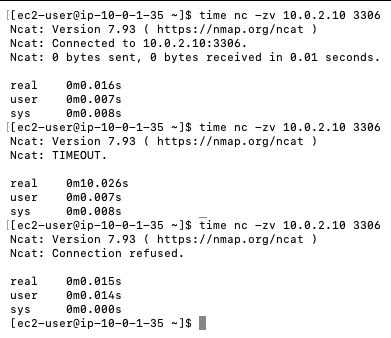

# 네트워크 트러블슈팅: 보안 그룹 vs 네트워크 ACL

웹 EC2 → DB EC2(3306) 연결을 **일부러 막아 보고**, 어디서 막혔는지에 따라 증상이 어떻게 달라지는지 확인한 실험입니다.

| 실험 | 막은 곳 | 확인하려는 것 |
| --- | --- | --- |
| 1-1 | 보안 그룹 인바운드 (`db-sg` 3306 제거) | 방화벽에서 막히면 → 기다리다 **timeout** |
| 1-2 | MariaDB 서비스 중지 | 서버에는 닿았는데 포트가 닫혀 있으면 → 즉시 **Connection refused** |
| 2 | 네트워크 ACL 아웃바운드 (목적지 포트 5555 거부) | NACL은 stateless라서 **들어온 요청에 대한 응답도** 따로 막힌다 |

## 실험 환경

| 항목 | 값 |
| --- | --- |
| 웹 EC2 | `board-public` (`10.0.1.0/24`), 보안 그룹 `web-sg` |
| DB EC2 | `board-private` (`10.0.2.0/24`), 보안 그룹 `db-sg` |
| 네트워크 ACL | 두 서브넷이 VPC의 **기본 NACL 하나**를 함께 사용 (모두 허용) |
| 확인 도구 | `nc`(ncat): 앱·DB 로그인을 거치지 않고 **TCP 연결만** 시도 |

### 왜 `curl /health`가 아니라 `nc`인가

`/health`는 **네트워크 → MariaDB 프로세스 → DB 로그인 → 권한**을 한 번에 거치므로, 실패했을 때 어느 단계에서 막혔는지 바로 알기 어렵습니다.
`nc`는 **TCP 연결(3-way handshake)만** 시도합니다. 그래서 "포트까지 길이 열려 있는가, 포트에서 누가 기다리고 있는가"만 따로 떼어 확인할 수 있습니다.

| `nc` 결과 | 의미 | 다음에 볼 곳 |
| --- | --- | --- |
| `Connected to ...` | 네트워크·포트 모두 정상 | DB 계정, 비밀번호, 권한 (`/health` 에러 코드) |
| 즉시 `Connection refused.` | 서버에는 닿았지만 포트에서 기다리는 프로세스가 없음 | MariaDB 실행 여부, `bind-address` |
| 10초 기다린 뒤 `TIMEOUT.` | 가는 길 또는 돌아오는 길에서 패킷이 사라짐 | 보안 그룹, NACL, 라우팅 테이블 |

### 준비

```bash
# [웹 EC2] ncat 설치
sudo dnf install -y nmap-ncat
```

실험 전 정상 상태를 먼저 기록합니다.

```bash
# [웹 EC2] -z: 데이터를 주고받지 않고 연결만 확인 후 종료, -v: 과정 출력
time nc -zv <DB EC2 프라이빗 IP> 3306
```

```
Ncat: Version 7.93 ( https://nmap.org/ncat )
Ncat: Connected to 10.0.2.10:3306.
Ncat: 0 bytes sent, 0 bytes received in 0.01 seconds.

real    0m0.016s
```

---

## 실험 1. 보안 그룹 차단 vs MariaDB 중지

### 1-1. `db-sg`에서 3306 인바운드 규칙 제거

**재현**

EC2 콘솔 → 보안 그룹 → `db-sg` → 인바운드 규칙 편집 → `MySQL/Aurora 3306 (소스 web-sg)` 삭제

```bash
# [웹 EC2]
time nc -zv <DB EC2 프라이빗 IP> 3306
```

**결과**

```
Ncat: Version 7.93 ( https://nmap.org/ncat )
Ncat: TIMEOUT.

real    0m10.026s
```

- 에러가 바로 나지 않고 **ncat의 기본 연결 제한 시간인 10초를 다 기다린 뒤** `TIMEOUT`이 납니다. (`-w 5`처럼 옵션을 주면 그 시간만큼 기다립니다.)
- DB EC2에 SSH로 접속해 보면 `systemctl is-active mariadb`가 `active`입니다. DB는 정상이고 네트워크에서 막혔다는 뜻입니다(22번 규칙은 남아 있어 SSH는 됩니다).

**원인**

보안 그룹은 허용 규칙에 없는 패킷을 **아무 응답 없이 버립니다(drop).** 웹 EC2는 연결 요청(SYN)을 보냈지만 거부 응답조차 받지 못하니, 정해 둔 시간이 지날 때까지 기다리다 포기합니다.

**복구**

`db-sg` 인바운드에 `MySQL/Aurora`, `3306`, 소스 `web-sg`를 다시 추가하고, `nc`가 다시 `Connected`인지 확인합니다.

### 1-2. (비교) MariaDB 서비스 중지

보안 그룹을 복구한 상태에서, 이번에는 DB 서버의 프로세스를 멈춥니다.

**재현**

```bash
# [DB EC2]
sudo systemctl stop mariadb
systemctl is-active mariadb    # inactive
```

```bash
# [웹 EC2]
time nc -zv <DB EC2 프라이빗 IP> 3306
```

**결과**

```
Ncat: Version 7.93 ( https://nmap.org/ncat )
Ncat: Connection refused.

real    0m0.015s
```

- 에러가 **즉시(0.015초)** 납니다. 정상 연결(0.016초)과 걸린 시간이 거의 같습니다. 거부 응답이 정상 응답만큼 빨리 돌아왔다는 뜻입니다.

**원인**

패킷은 보안 그룹을 통과해 DB EC2까지 도착했지만, 3306 포트에서 기다리는 프로세스가 없습니다. 그래서 DB EC2의 OS가 **"여기 아무도 없다"는 거부 응답(TCP RST)** 을 바로 돌려보냅니다.

**복구**

```bash
# [DB EC2]
sudo systemctl start mariadb
```

### 1-1과 1-2 비교



위에서부터 **정상 → `db-sg` 3306 제거 → MariaDB 중지** 순서로 같은 명령을 실행한 결과입니다.

| | 정상 | 1-1 보안 그룹 차단 | 1-2 MariaDB 중지 |
| --- | --- | --- | --- |
| `nc` 결과 | `Connected` | `TIMEOUT.` | `Connection refused.` |
| 걸린 시간 | 0.016초 | **10.026초** (기본 제한 시간을 다 채움) | **0.015초** |
| 패킷이 DB EC2에 도착했나 | 예 | 아니오 (보안 그룹에서 버려짐) | 예 |
| 누가 응답했나 | MariaDB | 아무도 | DB EC2의 OS (RST) |
| 먼저 볼 곳 | - | 보안 그룹, NACL, 라우팅 | `systemctl status mariadb`, `bind-address` |

> **정리:** timeout은 "가는 길 어딘가에서 사라졌다", `Connection refused`는 "도착은 했는데 문이 닫혀 있다"입니다. 에러 종류와 걸린 시간만 보고도 네트워크 문제인지 서버 문제인지 나눌 수 있습니다.

---

## 실험 2. 네트워크 ACL 아웃바운드 차단 (stateless 확인)

### 원리

TCP 연결에서 웹 EC2는 **출발지 포트로 임시 포트(ephemeral port, 보통 32768-60999)** 하나를 골라 씁니다. DB는 응답을 그 임시 포트로 돌려보냅니다.
이 실험에서는 웹 EC2의 출발지 포트를 5555로 고정하고, DB 서브넷에서 **목적지 포트 5555로 나가는 패킷**을 막습니다.

```
요청: 웹 EC2 :5555  ──▶  DB EC2 :3306    DB 서브넷 인바운드  (목적지 3306) → 허용 (DB에 도착)
응답: 웹 EC2 :5555  ◀──  DB EC2 :3306    DB 서브넷 아웃바운드 (목적지 5555) → 거부 ✖
```

- **보안 그룹**은 stateful이라, 들어오도록 허용한 요청의 응답은 아웃바운드 규칙과 상관없이 **자동으로 나갑니다.**
- **NACL**은 stateless라서 요청을 받아들였다는 걸 기억하지 않습니다. DB가 **들어온 요청에 답장하는 것조차** 새 패킷처럼 아웃바운드 규칙으로 다시 검사하고, 거기서 막힙니다.

"들어오게 허용했으면 답장은 당연히 나가겠지"라는 생각이 NACL에서는 틀린다는 것을 확인하는 실험입니다.
앱(`/health`)은 출발지 포트를 고를 수 없으므로 `nc`(ncat)의 `-p` 옵션으로 출발지 포트를 고정합니다.

### 규칙 추가 전

```bash
# [웹 EC2] 출발지 포트 5555로 접속 → 규칙이 없으니 Connected
time nc -zv -p 5555 <DB EC2 프라이빗 IP> 3306
```

> 같은 출발지 포트로 연달아 접속하면 이전 연결이 정리되기 전까지(약 1분) `Address already in use`가 날 수 있습니다. 이때는 1분쯤 기다렸다가 다음 단계로 넘어갑니다.

### 재현

VPC 콘솔 → 네트워크 ACL → `board-vpc`의 NACL (**서브넷 연결** 탭에서 `board-public`, `board-private`가 모두 연결됐는지 확인) → **아웃바운드 규칙** 편집 → 규칙 추가

| 규칙 번호 | 유형 | 포트 범위 | 대상 | 허용/거부 |
| --- | --- | --- | --- | --- |
| `90` | 사용자 지정 TCP | `5555` | `10.0.1.0/24` | **거부** |

- 번호를 기본 허용 규칙(`100`)보다 작게 해야 먼저 평가됩니다.
- 목적지 포트가 5555인 패킷만 막으므로 SSH, 웹 접속, 앱의 DB 연결에는 영향이 없습니다.
- 두 서브넷이 같은 NACL을 쓰므로 이 규칙은 웹 서브넷 아웃바운드에도 적용되지만, 웹 EC2가 목적지 포트 5555로 보내는 트래픽은 없어서 영향이 없습니다.

```bash
# [웹 EC2] 출발지 포트 5555로 접속
time nc -zv -p 5555 <DB EC2 프라이빗 IP> 3306

# [웹 EC2] 대조군: 5556은 여전히 성공
time nc -zv -p 5556 <DB EC2 프라이빗 IP> 3306
```

**예상 결과**

| 출발지 포트 | 규칙 추가 전 | 규칙 추가 후 |
| --- | --- | --- |
| `5555` | 즉시 `Connected` | 10초 후 `TIMEOUT.` |
| `5556` | 즉시 `Connected` | 즉시 `Connected` |

**요청이 DB에 도착했다는 증거 (선택)**

DB EC2 터미널에서 소켓 상태를 보면서 웹 EC2에서 5555로 접속해 봅니다.

```bash
# [DB EC2]
watch -n 0.5 "ss -tan | grep 5555"
# SYN-RECV  0  0  10.0.2.x:3306  10.0.1.x:5555
```

`SYN-RECV`는 **DB가 요청(SYN)을 받고 응답(SYN-ACK)을 보냈지만, 그 뒤 확인(ACK)이 돌아오지 않은 상태**입니다. 요청은 들어왔고, DB의 응답이 DB 서브넷을 나가다 막혔다는 뜻입니다. 1-1의 보안 그룹 차단 때는 패킷이 DB에 닿지 않으므로 여기에 아무것도 나오지 않습니다.

### 원인

NACL은 stateless라서, 인바운드에서 허용한 요청에 대한 **DB의 응답(목적지 포트 5555)도 아웃바운드 규칙으로 다시 검사**합니다. 규칙 `90`이 이 응답을 거부해서 연결이 완성되지 않았습니다.

> 인바운드 규칙으로 웹 서브넷에 **들어오는** 목적지 포트 5555를 막아도 결과는 같습니다(10초 후 `TIMEOUT`). 막는 지점이 "응답이 DB 서브넷을 나갈 때"에서 "웹 서브넷에 들어올 때"로 바뀔 뿐입니다.

### 복구

NACL **아웃바운드** 규칙 `90`을 삭제합니다. (인바운드 탭에는 없으니 헷갈리지 않도록 주의)

```bash
# [웹 EC2] 1분쯤 지난 뒤 다시 Connected 인지 확인
time nc -zv -p 5555 <DB EC2 프라이빗 IP> 3306
```

---

## 정리: 보안 그룹 vs 네트워크 ACL

| | 보안 그룹 | 네트워크 ACL |
| --- | --- | --- |
| 적용 단위 | 인스턴스(ENI) | 서브넷 |
| 규칙 | 허용만 | 허용 + 거부, 번호 순서대로 평가 |
| 상태 | **stateful**: 응답은 자동 허용 | **stateless**: 응답도 규칙 검사 |
| 막혔을 때 증상 | timeout | timeout |
| 이번 실험 | 요청이 DB에 도착하지 못함 | 요청은 도착, **DB의 응답이 나가지 못함** |

### 배운 점

1. **timeout이면 네트워크, refused면 서버부터 확인합니다.** 에러 종류로 원인 범위를 절반으로 줄일 수 있습니다.
2. **보안 그룹과 NACL은 앱 입장에서 똑같이 timeout으로 보입니다.** 에러만으로는 어느 쪽인지 알 수 없으므로 둘 다 확인해야 합니다.
3. **NACL을 쓸 때는 응답이 오가는 임시 포트(1024-65535)도 열어 둬야 합니다.** 새 NACL은 기본이 전부 거부라서, DB 서브넷에 인바운드 3306만 허용하면 요청은 들어가도 응답이 나가지 못해 연결되지 않습니다. 아웃바운드와 상대 서브넷 인바운드에 임시 포트를 함께 허용해야 합니다.
